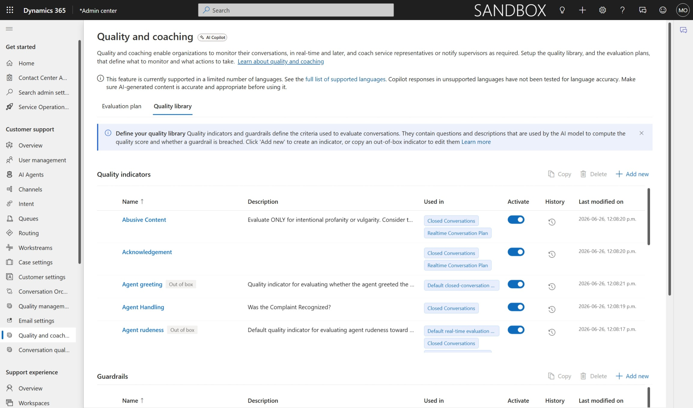

# Agent Assist Sample Data

This solution pre-populates a set of ready-to-use configurations in Dynamics 365 Contact Center, giving admins and supervisors a working baseline for the AI-powered agent suite — so you can explore, demo, and validate features without starting from scratch.

## What is Quality Assurance Agent (QAA)?

Quality Assurance Agent (QAA) is the new AI-powered supervisor agent in Dynamics 365 Contact Center. It continuously monitors conversations, evaluates quality and compliance, provides coaching nudges, and alerts supervisors in real time when issues are detected. It also evaluates completed conversations and generates scores, insights, and recommendations.

